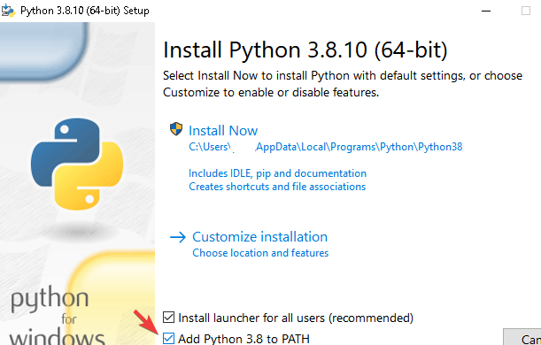
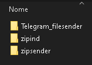

# GUIA DO ZIPSENDER - Fatia independente, envia pro Telegram

Versão v100

## Sumário

- [GUIA DO ZIPSENDER - Fatia independente, envia pro Telegram](#guia-do-zipsender---fatia-independente-envia-pro-telegram)
  - [Sumário](#sumário)
  - [Importante](#importante)
  - [Introdução](#introdução)
  - [1 Preparando o ambiente](#1-preparando-o-ambiente)
    - [1.1 python](#11-python)
      - [Para obter o python:](#para-obter-o-python)
    - [1.2 Compactadores-Winrar ou 7zip](#12-compactadores-winrar-ou-7zip)
  - [2 Preparação os utilitários](#2-preparação-os-utilitários)
    - [1 - Modo simples - Kit configurado em ptbr](#1---modo-simples---kit-configurado-em-ptbr)
    - [2 - Modo avançado - Construa e configure do zero](#2---modo-avançado---construa-e-configure-do-zero)
      - [Como baixar](#como-baixar)
    - [Atualizações de dependências](#atualizações-de-dependências)
  - [3 Como ativar o fluxo contínuo](#3-como-ativar-o-fluxo-contínuo)
    - [3.1 - Ativando a esteira automática de empacotamento](#31---ativando-a-esteira-automática-de-empacotamento)
    - [3.2 - Ativando a esteira automática de envio](#32---ativando-a-esteira-automática-de-envio)
      - [Configuração de token](#configuração-de-token)
      - [Configuração do grupo/canal destino](#configuração-do-grupocanal-destino)
      - [De volta a esteira de envio](#de-volta-a-esteira-de-envio)
    - [Processo em lote](#processo-em-lote)
  - [Customização e maiores detalhes](#customização-e-maiores-detalhes)
  - [Conclusão](#conclusão)

## Importante

Nenhum dos softwares utilizados nesse tutorial possui relação direta como o objetivo deste tutorial.

O uso dos softwares em conjunto para qualquer objetivo, é por uma decisão individual de responsabilidade de cada usuário.

## Introdução

Este tutorial ensinará como disponibilizar um fluxo contínuo de processo e postagem de pastas de arquivos no telegram de modo fatiado em partes independentes.

Também há funções especiais e opcionais, como:
- Envio dos arquivos em formato de 'album', agrupado em até 10 arquivos.
- Sticker separador de projetos
- Customização de descrição da primeira parte do projeto
- Postagem de Relatório de Conteúdo em txt, que mapeia todos os arquivos internos de cada "parte independente"

O "fluxo contínuo" torna todo o processo eficiente, pois enquanto a ferramenta executa de forma contínua, o usuário apenas depositas novas pastas no local configurado como início e todo o processo de fatiamento e envio é realizado automaticamente e indefinidamente.

Uma "parte independente" é capaz de ser extraída sem depender das demais partes que compõe o conjunto da pasta.

O processo foi construído para ser eficiente para quem upa e para economizar espaço em disco do usuário que baixar os materiais. Ainda que um projeto tenha centenas de GBs, o usuário que baixa precisa ter apenas o espaço de armazenamento suficiente para baixar e extrair apenas 1 parte por vez, ou seja, menos de 4 gbs de espaço livre em disco.

## 1 Preparando o ambiente

O Zipsender é o app que facilita a postagem de pastas no telegram de forma fatiada em partes independentes.

Por baixo do cobertor, existem 2 apps especialistas: O `Zipind` e o `telegram_filesender`.

Para esses apps funcionarem, é necessário usar o sistema operacional Windows (10 ou 11 de 64 bits) e instalar algumas dependências:
O python e o Compactador.

### 1.1 python
Python é uma linguagem de programação de propósito genérico ao qual o Zipsender e seus apps dependentes foram construídos.

#### Para obter o python:
* Acesse o site python.org e [baixe](https://www.python.org/downloads/) a versão estável mais nova.
* No form 'Advanced Options', marque `Add python 3.?? to PATH`. Esta função automatiza a inclusão do Python no Path do windows, dispensando a repetição do trabalho executado no tópico anterior, com o ffmpeg.
* Clique em `Install`
* A instalação pode demorar alguns minutos, mas isso é normal.



### 1.2 Compactadores-Winrar ou 7zip
Winrar ou 7zip são softwares compactadores que permitem agregar vários arquivos dentro de um único arquivo, facilitando o envio/recebimento de todo o 'pacote de arquivos' como um único arquivo.

App [Winrar](https://www.win-rar.com/predownload.html?&L=9)
- Possibilita usar a suite para compactar arquivos em modo '.rar'.
- Exclusivo para sistema operacional Windows.

App [7zip](https://www.7-zip.org/download.html)
- Possibilita usar a suite para compactar arquivos em modo '.zip'.
- Funciona em Windows e Linux.
- Preferência de quem usa sistema operacional Linux.

Configuração:
- Instale o compactador que preferir ou ambos.
- Adicione a pasta do app às variáveis de ambiente seguindo os mesmos passos realizados anteriormente quando se instalou o ffmpeg, no tópico `Adicionar pasta às variáveis de ambiente`.


## 2 Preparação os utilitários

> Importante\
> Os utilitários devem ser colocados dentro de uma pasta na raiz de uma unidade do seu pc. Ex.: `D:/zipsender_suite`\
> Este detalhe evita que existam erros de [max_path](https://docs.microsoft.com/pt-br/windows/win32/fileio/maximum-file-path-limitation) durante o processamento dos projetos.

Você pode adquirir o zipsender pelo modo simples ou avançado.

Recomendamos o modo simples para quem não deseja investir tempo aprendendo o processo de configuração e customização neste momento. Escolha um modo.

### 1 - Modo simples - Kit configurado em ptbr

1. Acesse o canal do [telegram do zipsender](https://t.me/zipsender) e baixe a última versão já configurada em ptbr.

2. Descompacte numa pasta na raiz de uma unidade do pc, conforme sugerido anteriormente.

### 2 - Modo avançado - Construa e configure do zero

Baixe os utilitários nos seguintes links:

1. Zipind: [https://github.com/apenasrr/zipind](https://www.google.com/url?q=https://github.com/apenasrr/zipind&sa=D&ust=1608417945410000&usg=AOvVaw22EBq1e5Hj2e1qtxo5p8lj)
2. Telegram_filesender: [https://github.com/apenasrr/Telegram_filesender](https://github.com/apenasrr/Telegram_filesender)
3. Zipsender: [https://github.com/apenasrr/zipsender](https://github.com/apenasrr/zipsender)

#### Como baixar
- Clique no botão “Code” e, em seguida,
- Clique em “Download ZIP”.
- Repita o procedimento na página de cada utilitário


- Extraia todos os utilitários na pasta criada para a suite.
- Renomeie as pastas de cada utilitário, tirando o `“-master”` do nome cada uma. O resultado final deve ser esse:


```
CURIOSIDADE

O passo acima só foi necessário porque os utilitários foram baixados através do botão 'code' no site do github.
Se tivessem sido baixados por linha comando (git clone), as pastas apareceriam da forma desejada.
Para saber mais: https://docs.github.com/pt/github/creating-cloning-and-archiving-repositories/cloning-a-repository
```

`ATENÇÃO: OS PASSOS A SEGUIR DEVEM SER REPETIDOS EM TODOS OS UTILITÁRIOS.`

### Atualizações de dependências
O python é uma linguagem de programação, onde durante a atividade de programação, vários 'atalhos' são pegos através do uso de scripts que foram criados por outras pessoas. Esses scripts são chamados de 'Libs' (bibliotecas).

Cada utilitário composto pelo Zipsender possui diversas libs requeridas, que precisamos baixar e atualizar.

Para facilitar o processo, tudo foi resumido à execução de 1 arquivo.
- Para cada pasta de utilitário, abra sua pasta e execute o arquivo `update_libs.bat`.


## 3 Como ativar o fluxo contínuo

Agora que todas as ferramentas estão prontas, é hora de utilizá-las.

- Acesse a pasta do Zipsender e se certifique que existe uma pasta chamada '1-tozip' dentro dela. Se não tiver, crie. Ela será o local de início do fluxo de processo.
- Execute o arquivo "`zipsender_zip.bat`”
- Será aberto um `terminal` sem nenhuma informação na tela. Isso é normal, pois não há projeto autorizado no local de início do processo.

### 3.1 - Ativando a esteira automática de empacotamento

- Mova a pasta do projeto que você deseja fatiar e enviar para o telegram, para o local configurado com início do processo. Atualmente é a pasta '1-tozip' dentro da pasta do zipsender.
- Renomeie a pasta do projeto adicionando um sublinhado como primeiro caracter do nome da pasta. Ou seja, se a pasta se chamava "`minhas coisas-2020`", ela deverá ser renomeada para "`_minhas coisas-2020`".
- Volte para a janela do terminal do `zipsender_zip` e note que automaticamente o projeto foi identificado e começou a ser processado. Depois de processado, os arquivos empacotados em modo independente serão movidos para a pasta `3-toupload`. Já a pasta original do projeto será movida para a pasta `2-zipped`.

### 3.2 - Ativando a esteira automática de envio

O zipsender envia automaticamente e indefinidamente os projetos empacotados e fatiados para um canal ou grupo do telegram.

Para fazer envio, é necessário estabelecer uma conexão entre o zipsender e o telegram. Para isso precisamos configurar o token da sua conta.

#### Configuração de token
Para se conectar ao Telegram via API, é necessário obter um `api_id` e um `api_hash`.\
Mas não se preocupe, só é necessário seguir essas etapas uma vez na vida:
- Para obter as credenciais para a API do Telegram:
  - Acesse a área de [gestão de apps](https://my.telegram.org/auth?to=apps) no site do telegram.
  - Entre com seu número de telefone em modelo internacional. Com prefixo `+55` para o caso de telefone brasileiro, seguido do DDD local e seu número de telefone.
    - Exemplo: Para telefone de São Paulo, com ddd 11, deverá ser digitado algo como: `+5511995429405`
  - Preencha o formulário e então aparecerá seus códigos de `api_id` e `api_hash`
  - Para assistir o processo em detalhes, assista [este vídeo](https://www.youtube.com/watch?v=8naENmP3rg4) que exemplifica tudo rapidamente.
- Após obter sua `api_id` e `api_hash`
- Na pasta do Telegram_filesender, abra o arquivo `credentials.py` em qualquer editor de texto, como o notepad.
- Preencha as flags `api_id` e `api_hash` com os dados que você salvou. Semelhante ao exemplo abaixo:
  - `api_id = 1111111`
  - `api_hash = "sKwrdX7tb2xFDkPU9h0AsKwrdX7tb2xF"`
- Os valores informados acima são apenas exemplos. Os valores são inválidos.
- Salve e feche o arquivo

#### Configuração do grupo/canal destino

Para determinar o destino do upload, você precisa obter o chat_id do grupo/canal.

Existem várias formas de obter o chat_id de um canal. Mostraremos duas delas:
- Usando o telegram client [Kotatogram](https://kotatogram.github.io/download/):
  - Acesse a tela de descrição do canal
  - Copie o `chat_id` que aparece abaixo do nome do canal
- Usando bot Find_TGIDbot:
  - Acesse a janela do bot [@Find_TGIDbot](http://t.me/Find_TGIDbot) e o inicie
  - Encaminhe qualquer postagem do canal para este bot
  - O bot responderá com o ID do remetente da mensagem. Neste caso, o ID do canal.
- Copie o `chat_id` (incluindo o sinal de subtração). Vale ressaltar que canais começam com o número '-100'.

Agora sim, poderemos configurar:
- Abra o arquivo `config.ini` presente na pasta do zipsender.
- Cole o chat id do seu canal/grupo na variável chat_id do arquivo.

#### De volta a esteira de envio

- Execute o arquivo "`zipsender_send.bat`”
- Será aberto um `terminal` sem nenhuma informação na tela. Assim que a esteira de empacotamento finalizar a geração dos arquivos fatiados de algum projeto, esta esteira de envio detectará o projeto e começará o envio para o telegram!

- Na primeira vez que você for usar o zipsender, será preciso autenticar uma conexão com o telegram. Mas será só da primeira vez! E depois nunca mais. :) Autenticar é simple, segue os passos:
  - Aparecerá uma mensagem pedindo o número de seu telefone em formato internacional. Com prefixo `+55` para o caso de telefone brasileiro, seguido do DDD local e seu número de telefone.
    - Exemplo: Para telefone de São Paulo, com ddd 11, deverá ser digitado algo como: `+5511995429405`
  - Na mensagem perguntando se o número está correto, digite `y`.
  - Se você tiver 'segurança de 2 fatores' (2fa) ativado na sua conta, será solicitado sua senha.


Cumprindo bem todos os passos anteriores, será questão de tempo para o projeto começar a aparecer no grupo/canal destino em fatias independentes.

### Processo em lote

O zipsender foi desenhado para trabalhar num fluxo contínuo de atividade. Assim você pode adicionar dezenas de projetos na pasta de início, autorizar o processamento e esperar por horas até que todos sejam processados e enviados.

A única etapa nesse processo que parece manual demais, seria a atividade de autorização com aquele 'sublinhado' no início do nome de cada pasta de projeto.

Mas é possível autorizar todos os projetos da pasta inicial de uma vez. Para isso execute o arquivo "`auth_all_folders.bat`". Feito! Já foram renomeados!


Agora tudo será enviado com o tempo. Parabéns! \ o /

## Customização e maiores detalhes

O zipsender é bem customizável. Vamos passar rapidamente pelas variáveis do arquivo "`config.ini`" que podem ser customizadas.

folder_tozip = `C:\#ZS` # Local da pasta de início do processo.
> Recomendo esta variável seja alterada para uma pasta na raiz de sua unidade de disco.\
> Caso a unidade onde o zipsender está seja a unidade `C`, crie uma pasta chamada `#ZS` nesta unidade, ficando presente em: `C:\#ZS`.\
> É importante que a pasta inicial seja de nome curto e esteja na raiz da unidade, para minimizar o risco de erros por [max_path](https://docs.microsoft.com/pt-br/windows/win32/fileio/maximum-file-path-limitation) durante o uso da ferramenta.

folder_zipped = 2-zipped # Local onde os projetos originais serão movidos após serem empacotados.

folder_toupload = 3-toupload # Local onde os projetos empacotados serão descarregados e a partir daí os arquivos empacotados serão upados para o Telegram

folder_uploaded = 4-uploaded # Local onde os projetos empacotados serão movidos após serem upados. Rotineiramente é preciso apagar o conteúdo dessa pasta para não ficar com os arquivos empacotados acumulando no seu computador já tendo os enviado para o Telegram.

chat_id = -111111111 # chat_id do grupo/canal destino

chat_id_cache = -111111111 # Opcional. Para modo de envio em formato de álbum, é possível configurar um chat_id de um canal que serve de área temporária para o upload. Onde após todo o projeto ser upado, ele será automaticamente movido em formato de álbum para o canal/grupo destino.

sticker =  # código do sticker postado como separador de linha no canal/grupo destino.

custom_description = custom_description.txt # arquivo onde é possível customizar a descrição do primeiro arquivo de cada projeto postado.

part_singular = parte # palavra no singular para descrever citar a quantidade de partes

part_plural = partes # palavra no plural para descrever citar a quantidade de partes. Não vamos pagar mico nisso, neh? haha

mb_per_file = 2000 # Limite em megabyes que cada parte empacotada deve ter

max_path = 260 # Limite máximo da string de um 'caminho de arquivo' para gerar alerta de ajuste manual, minimizando erro de estourar um erro de max_path no seu sistema operacional.

mode = rar # Formato  de empacotamento. Pode ser rar (usando o winrar) ou zip (usando 7zip)

send_album = 0 # Modo de envio em formato de Álbum. 0 = Desativa; 1 = Ativa

log_folder_path = log_project # Local onde serão depositados os txts que serve de relatório de conteúdo dos projetos

log_project_sent_folder_path = log_project_sent # Local onde serão depositados os metadados para facilitar o registro do volume de projetos upados

title_log_file_list = Relatório de Conteúdo # Descrição do txt contendo o "Relatório de Conteúdo" que será postado no telegram antes dos arquivos empacotados.

## Conclusão

Ficamos felizes que você tenha concluído este tutorial. Vamos o melhorando com o tempo para tornar o uso e customização mais claros possíveis.

Compartilhe esse tutorial e contribua para acessibilizar material digital no mundo livre.

Seus amigos vão adorar ^^

---

`Já copia e cola no PV daquele teu amigo nerd haha`


olha o que descobri! com o [Zipsender](t.me/zipsender) dá pra postar várias pastas do meu PC para o telegram. Tudo automático, em zips independentes e ainda economizo espaço no meu HD. show demais! tem tutorial

[https://github.com/apenasrr/zipsender_docs](https://github.com/apenasrr/zipsender_docs)

