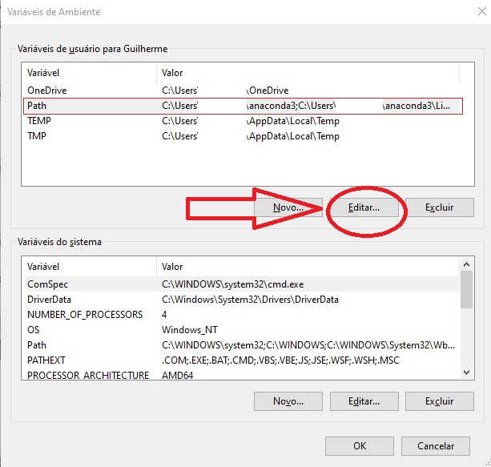

# GUIA DO ZIPSENDER - Fatia independente, envia pro Telegram

Versão v103

## Sumário

- [GUIA DO ZIPSENDER - Fatia independente, envia pro Telegram](#guia-do-zipsender---fatia-independente-envia-pro-telegram)
  - [Sumário](#sumário)
  - [Importante](#importante)
  - [Introdução](#introdução)
  - [1 Com chocolatey é mais gostoso](#1-com-chocolatey-é-mais-gostoso)
  - [2 Instalação manual](#2-instalação-manual)
    - [2.1 python](#21-python)
      - [Para obter o python:](#para-obter-o-python)
    - [2.2 Compactadores-Winrar ou 7zip](#22-compactadores-winrar-ou-7zip)
      - [Adicionar 7zip às variáveis de ambiente](#adicionar-7zip-às-variáveis-de-ambiente)
  - [3 Localização](#3-localização)
    - [3.1 - Modo simples - Kit configurado em ptbr](#31---modo-simples---kit-configurado-em-ptbr)
    - [3.2 - Modo avançado - Construa e configure do zero](#32---modo-avançado---construa-e-configure-do-zero)
      - [Como baixar](#como-baixar)
    - [Atualizações de dependências](#atualizações-de-dependências)
  - [4 Como ativar o fluxo contínuo](#4-como-ativar-o-fluxo-contínuo)
    - [4.1 - Ativando a esteira automática de empacotamento](#41---ativando-a-esteira-automática-de-empacotamento)
    - [4.2 - Ativando a esteira automática de envio](#42---ativando-a-esteira-automática-de-envio)
      - [Configuração de token](#configuração-de-token)
      - [Configuração do grupo/canal destino](#configuração-do-grupocanal-destino)
      - [De volta a esteira de envio](#de-volta-a-esteira-de-envio)
    - [Processo em lote](#processo-em-lote)
  - [Customização e maiores detalhes](#customização-e-maiores-detalhes)
  - [Conclusão](#conclusão)

## Importante

Nenhum dos softwares utilizados nesse tutorial possui relação direta como o objetivo deste tutorial.

O uso dos softwares em conjunto para qualquer objetivo, é por uma decisão individual de responsabilidade de cada usuário.

## Introdução

Este tutorial ensinará como executar um fluxo contínuo de postagem no telegram, de pastas de arquivos fatiadas em partes independentes.

Também há funções especiais e opcionais, como:
- Postagem automática de Imagem de capa e arquivo de texto com descrição
- Envio dos arquivos em formato de "álbum", agrupado em até 10 arquivos.
- Sticker separador de projetos
- Customização de descrição da primeira parte do projeto
- Postagem de Relatório de Conteúdo em txt, que mapeia todos os arquivos internos de cada "parte independente"

O "fluxo contínuo" torna todo o processo eficiente, pois enquanto a ferramenta executa de forma contínua, o usuário apenas deposita novas pastas no "local configurado como início" e todo o processo de fatiamento e envio é realizado automaticamente e indefinidamente.

Uma "parte independente" é capaz de ser extraída sem depender das outras partes que compõem o conjunto da pasta.

O processo foi construído para ser eficiente para quem upa os arquivos. E para ser cômodo para quem baixa os arquivos, pode não exigir muito espaço em disco do usuário que baixar os materiais. Ainda que um projeto tenha centenas de GBs, o usuário que baixa precisa ter apenas o espaço de armazenamento suficiente para baixar e extrair apenas 1 parte por vez. Ou seja, o usuário precisa ter menos de 4 gbs de espaço livre em disco para pouco a pouco a pouco consumir projetos com centenas de gbs!

Basta baixar uma parte, extrair, ler/assistir/consumir, apagar do disco e repetir o processo para as demais partes. Essa é a praticidade de um conjunto de arquivos fatiado em modo independente!

O Zipsender é o app que facilita a postagem de pastas no telegram de forma fatiada em partes independentes.

Ele pode ser usado em sistema operacional Windows (10 ou 11 de 64 bits), linux e tem por dependência, os softwares:
O Python, e o Compactador.

## 1 Com chocolatey é mais gostoso

Chocolatey é um gerenciador de pacote para sistema operacional Windows. Com ele, podemos instalar todos os softwares necessários por comandos no terminal, sem precisar entrar em cada site, fazer downloads e instalar cada aplicação manualmente. Ele permite instalar diversos softwares numa velocidade incrível. :)

**Instalar o chocolatey**

Assim como explicado na [página de instalação](https://chocolatey.org/install) do chocolatey, abra o powershell do windows com privilégio de administrador e execute o comando abaixo:

`Set-ExecutionPolicy Bypass -Scope Process -Force; [System.Net.ServicePointManager]::SecurityProtocol = [System.Net.ServicePointManager]::SecurityProtocol -bor 3072; iex ((New-Object System.Net.WebClient).DownloadString('https://community.chocolatey.org/install.ps1'))`

Caso você não saiba abrir o powershell:
1. Aperte a tecla windows (fica geralmente entre control e alt da esquerda)
2. Digite `powershell`
3. Clique com o botão direito no ícone do windows powershell
4. Clique na opção "Executar como administrador"

O chocolatey só será instalado adequadamente se você executar o powershell com privilégio de administrador.

**Instalar os pré-requisitos**

```
choco install python -y
choco install git -y
choco install 7zip -y
choco install advanced-renamer -y
```

Abra o terminal do windows com privilégio administrador e execute cada um dos comandos acima.

É fortemente recomendado a instalação do app "advanced renamer", que é um aplicativo que renomeia arquivos e pastas em lote. No uso do Zipsender você sentirá necessidade de renomear diversos arquivos e pastas, onde esta aplicação deixará tudo muito mais rápido e fácil.

**Baixar o Zipsender**

1. Crie uma pasta vazia chamada "Zipsender" na raiz do seu HD. Entre nela.
2. Digite `CTRL+L` no windows explorer.
3. Digite `cmd` na barra de endereço e tecle enter para abrir o terminal dentro da pasta do Zipsender.
4. Execute cada um dos comandos abaixo

```
git clone https://github.com/apenasrr/zipsender
cd zipsender
update_libs.bat
```

Agora que o Zipsender já está baixado, você pode pular para o tópico [4 Como ativar o fluxo contínuo](#4-como-ativar-o-fluxo-contínuo).

Mas caso deseje conhecer mais um pouco sobre cada pré-requisitos e seu processo manual de instalação e configuração, tenha uma boa leitura. :p

## 2 Instalação manual


Primeiramente é necessário usar o sistema operacional Windows (10 ou 11 de 64 bits) e instalar algumas dependências: O **python** e o **Compactador**.

> ATENÇÃO\
Antes de tudo, abra o Windows Explorer e garanta a exibição das extensões dos arquivos. Isso aumenta sua segurança, por evita o risco de no futuro você executar por acidente um vírus .exe achando que é uma foto .jpg. É uma função importante e bem fácil de ativar
- Vá no menu "Exibir" e então marque o checkbox “Extensões de nomes de arquivos”.


### 2.1 python
Python é uma linguagem de programação de propósito genérico ao qual o Zipsender e seus apps dependentes foram construídos.

#### Para obter o python:
* Acesse o site python.org e [baixe](https://www.python.org/downloads/) a versão estável mais nova.
* No form 'Advanced Options', marque `Add python 3.?? to PATH`. Esta função automatiza a inclusão do Python no Path do windows, dispensando a repetição do trabalho executado no tópico anterior, com o ffmpeg.
* Clique em `Install`
* A instalação pode demorar alguns minutos, mas isso é normal.


### 2.2 Compactadores-Winrar ou 7zip
Winrar ou 7zip são softwares compactadores que permitem agregar vários arquivos dentro de um único arquivo, facilitando o envio/recebimento de todo o 'pacote de arquivos' como um único arquivo.

App [Winrar](https://www.win-rar.com/predownload.html?&L=9)
- Possibilita usar a suite para compactar arquivos em modo '.rar'.
- Exclusivo para sistema operacional Windows.

App [7zip](https://www.7-zip.org/download.html)
- Possibilita usar a suite para compactar arquivos em modo '.zip'.
- Funciona em Windows e Linux.
- Preferência de quem usa sistema operacional Linux.

Configuração:
- Instale o compactador que preferir ou ambos.

#### Adicionar 7zip às variáveis de ambiente

Caso tenha instalado o 7zip, é necessário adicionar a pasta do app às variáveis de ambiente. Não é necessário fazer essa etapa caso você tenha instalado apenas o Winrar.

Será ensinado duas formas de fazer isso:
- A rápida, via terminal
- E simpática, via interface gráfica (GUI)

Execute apenas uma das formas.

**Rápido: Via Terminal**

- Abrir Terminal com privilégio de admin
  - `[WIN]+R, cmd, [CTRL]+[SHIFT]+[ENTER]`
- Entrar com o comando: `setx /M path "%path%;{path_folder}"`
	- Substituir `{path_folder}` pelo link da pasta a ser adicionada nas variáveis de sistema
	- Exemplo caso a pasta esteja em `C:\myapp`
		- `setx /M path "%path%;C:\myapp"`


**Simpático: Via interface gráfica**
- Para um aplicativo ser acessível via terminal a partir de qualquer local do seu sistema, busque o termo `variáveis de ambiente` na ferramenta de busca do windows e acesse a aplicação `editar as variáveis de ambiente do sistema`.
- Na aplicação que será aberta, acesse a guia `Avançado` e clique no botão `Variáveis de Ambiente`.


- No form "Variáveis de Ambiente", clique no nome `Path` na coluna `Variável`. Em seguida clique no botão `Editar`.



- No form "Editar a variável de ambiente", clique no botão "Novo" e adicione o caminho da pasta onde está o executável do app que você deseja tornar acessível via terminal. Seja a pasta do 7zip e/ou a pasta do Winrar.

- Para evitar erros, logo após adicionar o novo caminho, selecione o novo caminho adicionado, em seguida clique no botão `Mover para Cima`.
- Esta ação dará ao path criado, maior prioridade em relação aos demais paths da lista.

- Parabéns. O app foi configurado como variável de sistema!
- Para verificar se está tudo funcionando bem, basta abrir o CMD do Windows: (`[win]+[r], cmd, [enter]`)
- Digite `7z` ou `7za` (um dos dois funciona, dependendo da versão do seu windows) no terminal aberto e tecle `[Enter]`. Deve aparecer informações sobre o programa.
- Não se desespere com a quantidade de informação na tela. hehe É só um teste para saber se o comando está sendo reconhecido. Pode fechar a janela do terminal. :)

## 3 Localização

> Importante\
> A aplicação deve ser colocada dentro de uma pasta na raiz de uma unidade do seu pc. Ex.: `D:/zipsender`\
> Este detalhe evita que existam erros de [max_path](https://docs.microsoft.com/pt-br/windows/win32/fileio/maximum-file-path-limitation) durante o processamento dos projetos.

Você pode adquirir o zipsender pelo modo simples ou avançado.

Recomendamos o modo simples para quem não deseja investir tempo aprendendo o processo de configuração e customização neste momento. Escolha um modo.

### 3.1 - Modo simples - Kit configurado em ptbr

1. Acesse o canal do [telegram do zipsender](https://t.me/zipsender) e baixe a última versão já configurada em ptbr.

2. Descompacte numa pasta na raiz de uma unidade do pc, conforme sugerido anteriormente.

### 3.2 - Modo avançado - Construa e configure do zero

Baixe a aplicação:

1. Zipsender: [https://github.com/apenasrr/zipsender](https://github.com/apenasrr/zipsender)

#### Como baixar
- Clique no botão “Code” e, em seguida,
- Clique em “Download ZIP”.


- Extraia o utilitário na pasta criada.

```
CURIOSIDADE

Você pode baixar o repositório por linha comando (git clone).
Para saber mais: https://docs.github.com/pt/github/creating-cloning-and-archiving-repositories/cloning-a-repository
```

### Atualizações de dependências
O python é uma linguagem de programação, onde durante a atividade de programação, vários 'atalhos' são pegos através do uso de scripts que foram criados por outras pessoas. Esses scripts são chamados de 'Libs' (bibliotecas).

O Zipsender possui diversas libs requeridas, que precisamos baixar e atualizar.

Para facilitar o processo, tudo foi resumido à execução de 1 arquivo.
- Abra a pasta do zipsender e execute o arquivo `update_libs.bat`.


## 4 Como ativar o fluxo contínuo

- Acesse a pasta do Zipsender e execute o arquivo "`zipsender_zip.bat`”.
- Note que apareceu uma pasta chamada `1-tozip`, `2-zipped`, `3-toupload` e `4-uploaded`, que representam cada etapa da fila de processo.
- Será aberto um `terminal` sem nenhuma informação na tela. Isso é normal, pois não há projeto autorizado no local de início do processo.

### 4.1 - Ativando a esteira automática de empacotamento

- Mova a pasta do projeto que você deseja fatiar e enviar para o telegram, para o local configurado com início do processo. Atualmente é a pasta `1-tozip` dentro da pasta do zipsender.
- Renomeie a pasta do projeto adicionando um sublinhado como primeiro caracter do nome da pasta. Ou seja, se a pasta se chamava "`minhas coisas-2020`", ela deverá ser renomeada para "`_minhas coisas-2020`".
- Volte para a janela do terminal do `zipsender_zip` e note que automaticamente o projeto foi identificado e começou a ser processado. Depois de processado, os arquivos empacotados em modo independente serão movidos para a pasta `3-toupload`. Já a pasta original do projeto será movida para a pasta `2-zipped`.

### 4.2 - Ativando a esteira automática de envio

O zipsender envia automaticamente e indefinidamente os projetos empacotados e fatiados para um canal ou grupo do telegram.

Para fazer envio, é necessário estabelecer uma conexão entre o zipsender e o telegram. Para isso precisamos gerar as credenciais de acesso via API da sua conta do telegram.

#### Configuração de token
Para se conectar ao Telegram via API, é necessário obter um `api_id` e um `api_hash`.\
Mas não se preocupe, só é necessário seguir essas etapas uma vez na vida:
- Para obter as credenciais para a API do Telegram:
  - Acesse a área de [gestão de apps](https://my.telegram.org/auth?to=apps) no site do telegram.
  - Entre com seu número de telefone em modelo internacional. Com prefixo `+55` para o caso de telefone brasileiro, seguido do DDD local e seu número de telefone.
    - Exemplo: Para telefone de São Paulo, com ddd 11, deverá ser digitado algo como: `+5511995429405`
  - Preencha o formulário e então aparecerá seus códigos de `api_id` e `api_hash`
  - Para assistir o processo em detalhes, assista [este vídeo](https://www.youtube.com/watch?v=8naENmP3rg4) que exemplifica tudo rapidamente.
- Após obter sua `api_id` e `api_hash`, guarde em um **local seguro**. Pois no futuro você poderá precisar delas para se relogar. Também essas credenciais são semelhantes a usuário-senha da sua conta, então **não compartilha com ninguém**!

#### Configuração do grupo/canal destino

Para determinar o destino do upload, você precisa obter o `chat_id` do grupo/canal que você deseja depositar os arquivos.

Existem várias formas de obter o chat_id de um canal. Mostraremos duas delas:
- Usando o telegram client [Kotatogram](https://kotatogram.github.io/download/):
  - Acesse a tela de descrição do canal
  - Copie o `chat_id` que aparece abaixo do nome do canal
- Usando bot Find_TGIDbot:
  - Acesse a janela do bot [@Find_TGIDbot](http://t.me/Find_TGIDbot) e o inicie
  - Encaminhe qualquer postagem do canal para este bot
  - O bot responderá com o ID do remetente da mensagem. Neste caso, o ID do canal.
- Copie o `chat_id` (incluindo o sinal de subtração). Vale ressaltar que canais começam com o número '-100'.

Agora sim, poderemos configurar:
- Abra o arquivo `config.ini` presente na pasta do zipsender.
- Cole o chat id do seu canal/grupo na variável `chat_id` do arquivo.

#### De volta a esteira de envio

- Execute o arquivo "`zipsender_send.bat`”
- Será aberto um `terminal`.
- Se for a primeira vez que você estiver executando, será preciso autenticar uma conexão com o telegram. Mas será só da primeira vez! E depois nunca mais. :) Autenticar é simple, segue os passos:
  - Informe seu `api_id` e `api_hash`.
  > `"Enter phone number or bot token:"`
  - Aparecerá esta mensagem pedindo o número de seu telefone em formato internacional.
  - Digite seu número de telefone com prefixo `+55` para o caso de telefone brasileiro, seguido do DDD local e seu número de telefone.
    - Exemplo: Para telefone de São Paulo, com ddd 11, deverá ser digitado algo como: `+5511995429405`
  - Na mensagem perguntando se o número está correto, digite `y`.
  - Será solicitado um código de autenticação que o telegram enviou no seu app do celular/desktop. Confira lá e digite no terminal.
  - Se você tiver 'segurança de 2 fatores' (2fa) ativado na sua conta, será solicitado sua senha pessoal.
  - Tendo realizado a conexão, repare que apareceu o arquivo `user.session` na pasta do Zipsender. Este arquivo representa a ponte de conexão do zipsender com sua conta do telegram. Enquanto ele estiver válido, você não precisará mais digitar api_id e api_hash para usar o zipsender. Caso ele seja deletado, o zipsender será incapaz de se conectar com sua conta do telegram e um novo processo de conexão será necessário. Suas credenciais não serão salvas em local algum.
- Com a conexão configurada, quando a esteira de empacotamento (zipsender_zio.bat) finalizar a geração dos arquivos fatiados de algum projeto, esta esteira de envio (zipsender_send) detectará o projeto e começará o envio para o telegram!

Cumprindo bem todos os passos anteriores, será questão de tempo para o projeto começar a aparecer no grupo/canal destino em fatias independentes.

### Processo em lote

O zipsender foi desenhado para trabalhar num fluxo contínuo de atividade. Assim você pode adicionar dezenas de projetos na pasta de início, autorizar o processamento e esperar por horas até que todos sejam processados e enviados.

A única etapa nesse processo que parece manual demais, seria a atividade de autorização com aquele 'sublinhado' no início do nome de cada pasta de projeto.

Mas é possível autorizar todos os projetos da pasta inicial de uma vez. Para isso execute o arquivo "`auth_all_folders.bat`". Feito! Já foram renomeados!


Agora tudo será enviado com o tempo. Parabéns! \ o /

## Customização e maiores detalhes

O zipsender é bem customizável. A descrição do primeiro arquivo de cada projeto pode ter seu padrão definido pelo arquivo `custom_description.txt`.

Se a pasta do projeto contiver uma imagem chamada `cover` (seja arquivo jpg, png ou gif), ela será identificada como Capa e automaticamente postada ao topo do envio.

Se a pasta do projeto contiver um arquivo de texto chamado `description.txt`, ele será identificado como Descrição e automaticamente postado abaixo da capa na fila de envio.

Outras customizações podem ser realizadas pelo arquivo `config.ini`. Vamos passar rapidamente pelas variáveis deste arquivo que podem ser customizadas.

folder_tozip = `C:\#ZS` # Local da pasta de início do processo.
> Recomendo esta variável seja alterada para uma pasta na raiz de sua unidade de disco.\
> Caso a unidade onde o zipsender está seja a unidade `C`, crie uma pasta chamada `#ZS` nesta unidade, ficando presente em: `C:\#ZS`.\
> É importante que a pasta inicial seja de nome curto e esteja na raiz da unidade, para minimizar o risco de erros por [max_path](https://docs.microsoft.com/pt-br/windows/win32/fileio/maximum-file-path-limitation) durante o uso da ferramenta.

folder_zipped = 2-zipped # Local onde os projetos originais serão movidos após serem empacotados.

folder_toupload = 3-toupload # Local onde os projetos empacotados serão descarregados e a partir daí os arquivos empacotados serão upados para o Telegram

folder_uploaded = 4-uploaded # Local onde os projetos empacotados serão movidos após serem upados. Rotineiramente é preciso apagar o conteúdo dessa pasta para não ficar com os arquivos empacotados acumulando no seu computador já tendo os enviado para o Telegram.

chat_id = -111111111 # chat_id do grupo/canal destino

chat_id_cache = -111111111 # Opcional. Para modo de envio em formato de álbum, é possível configurar um chat_id de um canal que serve de área temporária para o upload. Onde após todo o projeto ser upado, ele será automaticamente movido em formato de álbum para o canal/grupo destino.

sticker =  # código do sticker postado como separador de linha no canal/grupo destino.

custom_description = custom_description.txt # arquivo onde é possível customizar a descrição do primeiro arquivo de cada projeto postado.

part_singular = parte # palavra no singular para descrever citar a quantidade de partes

part_plural = partes # palavra no plural para descrever citar a quantidade de partes. Não vamos pagar mico nisso, neh? haha

mb_per_file = 2000 # Limite em megabyes que cada parte empacotada deve ter

max_path = 260 # Limite máximo da string de um 'caminho de arquivo' para gerar alerta de ajuste manual, minimizando erro de estourar um erro de max_path no seu sistema operacional.

mode = rar # Formato  de empacotamento. Pode ser rar (usando o winrar) ou zip (usando 7zip)

send_album = 0 # Modo de envio em formato de Álbum. 0 = Desativa; 1 = Ativa

log_folder_path = log_project # Local onde serão depositados os txts que serve de relatório de conteúdo dos projetos

log_project_sent_folder_path = log_project_sent # Local onde serão depositados os metadados para facilitar o registro do volume de projetos upados

title_log_file_list = Relatório de Conteúdo # Descrição do txt contendo o "Relatório de Conteúdo" que será postado no telegram antes dos arquivos empacotados.

## Conclusão

Ficamos felizes que você tenha concluído este tutorial. Vamos o melhorando com o tempo para tornar o uso e customização mais claros possíveis.

Compartilhe esse tutorial e contribua para acessibilizar material digital no mundo livre.

Seus amigos vão adorar ^^

---

`Já copia e cola no PV daquele teu amigo nerd haha`


olha o que descobri! com o [Zipsender](t.me/zipsender) dá pra postar várias pastas do meu PC para o telegram. Tudo automático, em zips independentes e ainda economizo espaço no meu HD. show demais! tem tutorial

[https://github.com/apenasrr/zipsender_docs](https://github.com/apenasrr/zipsender_docs)

